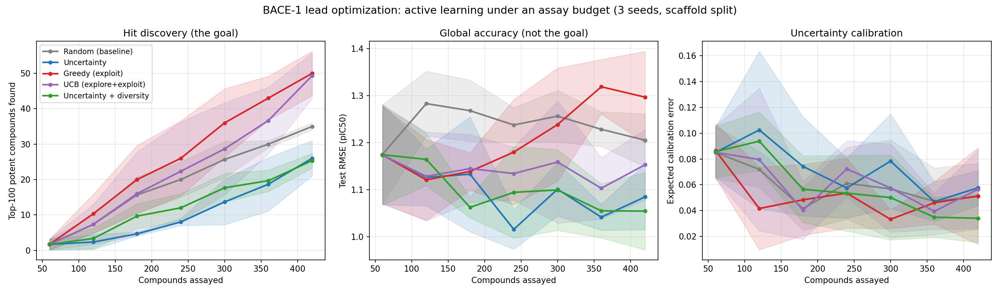

# Case study: BACE-1 lead optimization

This page walks through `examples/bace_lead_optimization.py`, which asks a
concrete question: **in a real lead optimization campaign, does active learning
actually pay for itself?**

The short answer is that it depends entirely on what you measure. Active
learning clearly wins at finding potent compounds, and clearly does *not* win
at global predictive accuracy. Those are different objectives, and conflating
them is the easiest way to conclude — wrongly — that active learning does not
work.

## The setup

**Target.** BACE-1 (β-secretase 1) is an aspartic protease that cleaves amyloid
precursor protein, and one of the most heavily pursued Alzheimer's disease
targets. The MoleculeNet BACE set contains 1,513 inhibitors with measured
binding affinity, reported as pIC50 (higher = more potent).

Unlike a physicochemical benchmark such as ESOL, this is a genuine medicinal
chemistry SAR series — dense analog families around a handful of chemotypes,
which is what a project's compound pool actually looks like.

```bash
python scripts/download_bace.py
python examples/bace_lead_optimization.py
```

**Split.** Bemis–Murcko scaffold split, not a random split. The largest
scaffold families go into the pool the campaign acquires from; the leftover
rare and singleton chemotypes are held out. That gives 671 scaffolds → 1,213
pool / 300 held-out, with zero scaffold overlap. A random split on an SAR series
would put near-identical analogs on both sides and badly overstate accuracy.

**Campaign.** 60 compounds assayed up front, then 6 rounds of 60 assays each —
420 assayed compounds out of 1,213, roughly a third of the pool.

**Features.** The `"rich"` 29-dimensional one-hot featurizer. This matters: with
the legacy 6-dimensional default the model barely beats predicting the mean, and
a model that barely beats the mean cannot rank compounds usefully.

## Two protocol details that decide the answer

Both are easy to get wrong, and both flatter the results when you do.

**Re-initialize the model every round.** If you warm-start a single model across
rounds at a fixed epoch count, by round 7 it has had seven times the gradient
steps of round 1. The curve then improves partly because of extra training, not
extra data, and you cannot tell the two apart. Every round here trains a fresh
model for the same 300 epochs.

**Fit label standardization on the labeled set only.** Pool labels are precisely
what the campaign has not measured yet. Standardizing against pool statistics
leaks the answer into the experiment. The mean and standard deviation are refit
from the assayed subset at the start of each round.

## Acquisition strategies

| Strategy | Score | Intent |
|----------|-------|--------|
| Random | — | Baseline |
| Uncertainty | predicted variance | Reduce model error |
| Greedy | predicted mean | Assay what looks most potent |
| UCB | mean + β·σ | Exploit, with an exploration bonus |
| Uncertainty + diversity | 0.7·variance + 0.3·Core-Set rank | Spread picks across the embedding space |

Note the uncertainty signal is the model's **predicted variance head**, not MC
dropout. On this codebase MC-dropout variance is essentially uncorrelated with
actual error (ESOL: r = −0.05), while the learned variance head carries real
signal (r = +0.36). Using MC dropout here is a large part of why molax's own
earlier benchmark made active learning look useless.

## Results

After 420 assayed compounds out of 1,213 (3 seeds, mean ± sd):

| Strategy | Top-100 found | Enrichment | Test RMSE |
|----------|---------------|------------|-----------|
| Random (baseline) | 35.0 ± 1.0 | 1.00× | 1.206 ± 0.057 |
| Uncertainty | 26.0 ± 5.0 | 0.74× | 1.085 ± 0.070 |
| **Greedy (exploit)** | **50.0 ± 6.2** | **1.43×** | 1.297 ± 0.098 |
| **UCB (explore+exploit)** | **49.3 ± 6.4** | **1.41×** | 1.153 ± 0.075 |
| Uncertainty + diversity | 25.3 ± 2.1 | 0.72× | **1.055 ± 0.082** |

Read the two numeric columns against each other. They rank the strategies in
almost exactly opposite order.

!!! note "Run-to-run variation"
    `jraph.segment_sum` lowers to a scatter-add, which is not deterministic on
    GPU, so fixed seeds do not give bit-identical results. An independent repeat
    of this table gave greedy 48.0 (1.37×), UCB 51.7 (1.48×), random 35.0,
    uncertainty 25.0 (0.71×). The ordering and the size of the gaps are stable;
    the third decimal place is not.

Per-round numbers are written to
`examples/assets/bace_lead_optimization.csv`.



## What this means

**Exploitation finds hits.** Greedy and UCB recover roughly 1.4× as many of
the 100 most potent compounds as random sampling, for the same assay budget.
Random finds 35; they find about 50. The gap is far larger than the spread
across seeds, and it widens monotonically with budget — see the left panel.

**Uncertainty sampling finds fewer hits than random.** At 0.74× and 0.72×, both
uncertainty-driven strategies are *worse than picking at random* at the thing a
lead optimization campaign is trying to do. This is not a bug. Uncertainty
sampling deliberately assays compounds the model finds confusing, and confusing
compounds are usually not the potent ones.

**And yet uncertainty sampling gives the best model.** It also produces the
lowest test RMSE (1.055 and 1.085, against 1.297 for greedy). It is doing
exactly what it is designed to do — it is simply designed for a different
objective.

So the answer to "does active learning work here?" depends entirely on the
yardstick:

- Scored on **hits found**, active learning works, and exploitative acquisition
  wins by ~40%.
- Scored on **global RMSE**, the exploitative strategies are the *worst* of the
  five, and the honest answer would be that active learning barely helps.

Both statements come from the same run. This is why the earlier molax benchmark
made active learning look useless: it measured only RMSE, on an acquisition
signal (MC-dropout variance) that carried no information anyway.

A practical takeaway: if the campaign goal is finding potent compounds, start
from an exploitative score and add exploration on top (UCB) rather than
acquiring on uncertainty alone. If the goal is a reusable predictive model,
invert that choice.

## Reusing the protocol

The pieces are all library functions:

```python
from molax import ATOM_FEATURIZERS, UncertaintyGCN, GCNConfig
from molax.acquisition import coreset_from_embeddings
from molax.metrics import evaluate_calibration
from molax.utils.data import smiles_to_jraph

graph = smiles_to_jraph(smiles, features="rich")
n_features = ATOM_FEATURIZERS["rich"].dim
```

`coreset_from_embeddings` is the index-based K-center greedy helper. Use it
rather than `coreset_sampling` when your molecules already live in one
pre-batched `GraphsTuple` driven by a boolean mask — re-batching the pool each
round changes array shapes and forces JIT recompilation, which is exactly what
the batch-once-then-mask pattern exists to avoid.
